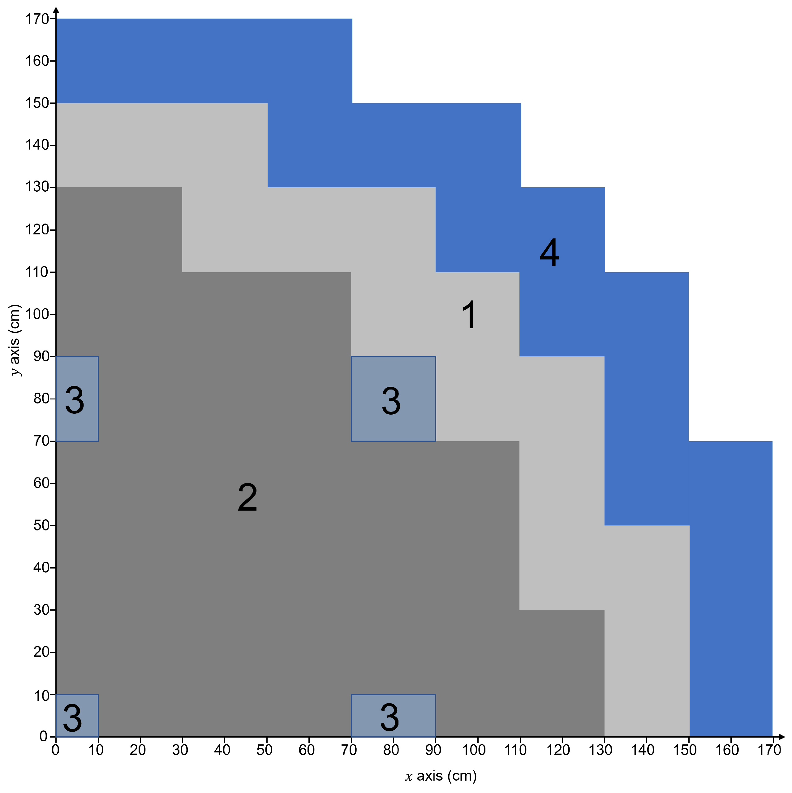

.. SciML_RP documentation master file, created by
   sphinx-quickstart on Sun Jun  4 16:33:14 2023.
   You can adapt this file completely to your liking, but it should at least
   contain the root `toctree` directive.

Welcome to AISEA's Team!
====================================

**AISEA: AI for Science with Engineering Applications**

Team Members
====================================

.. |QiaolinHe| image:: ./_static/prof/QiaolinHe.png
                    :width: 206
.. |ShiquanZhang| image:: ./_static/prof/ShiquanZhang.png
                    :width: 206

.. |HelinGong| image:: ./_static/prof/HelinGong.png
                    :width: 208
.. |HongjunJi| image:: ./_static/prof/HongjunJi.jpg
                    :width: 204

.. |QihongYang| image:: ./_static/stu/QihongYang.png
                    :width: 167

.. |ShupeiYu| image:: ./_static/stu/ShupeiYu.png
                    :width: 167

.. |XufanChen| image:: ./_static/stu/XufanChen.png
                    :width: 167

.. =================      ==================  ================
.. |QiaolinHe|            |ShiquanZhang|      |HelinGong|
.. =================      ==================  ================
.. Prof. Qiaolin He       A.P. Shiquan Zhang  A.P. Helin Gong
.. =================      ==================  ================

.. _Prof. Qiaolin He: https://math.scu.edu.cn/info/1252/2473.htm
.. _A.P. Shiquan Zhang: https://math.scu.edu.cn/info/1252/2525.htm
.. _A.P. Jialiang Lu: https://speit.sjtu.edu.cn/faculty/3
.. _A.P. Helin Gong: https://speit.sjtu.edu.cn/faculty/23
.. _A.P. Hongjun Ji: https://speit.sjtu.edu.cn/faculty/7
.. _Tch. Sijia Kong: https://speit.sjtu.edu.cn/faculty/35

+--------------------+---------------------+--------------------+
|    |QiaolinHe|     |  |ShiquanZhang|     |     |JialiangLu|   |
+--------------------+---------------------+--------------------+
| `Prof. Qiaolin He`_|`A.P. Shiquan Zhang`_|`A.P. Jialiang Lu`_ |
+--------------------+---------------------+--------------------+

+--------------------+--------------------+--------------------+
+     |HelinGong|    |     |HongjunJi|    |     |SijiaKong|    |
+--------------------+--------------------+--------------------+
+ `A.P. Helin Gong`_ | `A.P. Hongjun Ji`_ | `Tch. Sijia Kong`_ |
+--------------------+--------------------+--------------------+

.. _PhD. Yu Yang: https://github.com/YangYuSCU
.. _PhD. Qihong Yang: https://github.com/SummerLoveRain

+-------------------+---------------------+--------------------+--------------------+
|     |YuYang|      |     |QihongYang|    |    |YuyanXu|       |     |ZhijieSu|     |
+-------------------+---------------------+--------------------+--------------------+
|`PhD. Yu Yang`_    | `PhD. Qihong Yang`_ |   PhD. Yuyan Xu    |   M.S. Zhijie Su   |
+-------------------+---------------------+--------------------+--------------------+

+-------------------+---------------------+--------------------+--------------------+
|  |LizhanHong|     |     |HanLi|         |    |ShupeiYu|      |     |XufanChen|    |
+-------------------+---------------------+--------------------+--------------------+
| B.S. Lizhan Hong  |      M.S. Han Li    |   M.S. Shupei Yu   |   M.S. Xufan Chen  |
+-------------------+---------------------+--------------------+--------------------+

Research Fields
====================================

**Research Fields:**

 | **Scientific Computing + Maching Learning**

 | **Numerical Methods of Fluid Mechanics**

 | **Construction and Analysis of High-Precision Finite Element Method**

 | **Fast Algorithms for Solving Linear Equations**

 | **Model Reduction method and Machine Learning Methods**

 | **Modeling and Reconstruction based on Experimental Data**

 | **...**

Members of the team were awarded **the second prize of natural science by the Ministry of Education in 2020**, undertook **three research projects of the National Natural Science Foundation of China**, presided over **two sub-projects of the National Key Research and Development Program** and **one pre-research project of the installation and development**, published more than 50 papers in well-known national journals such as JCP and SIAM Multiscale Model and Simulation, and granted one patent. 

Recently, they have successfully completed the development of a module for 3D ground stress modelling and display of shale gas; designed an efficient pre-processing method for rapid solution of large-scale linear equation systems for subsea oil field development, improving the simulation efficiency; established a reconstruction model and algorithm based on partial observation data of reactors and fuel rods, realizing data reconstruction and inversion of physical parameters.

.. .. |Boat| image:: ./_static/nuclear/boat.png
..                   :width: 257
..                   :height: 149
.. .. |Base| image:: ./_static/nuclear/base.png
..                   :width: 257
..                   :height: 149
.. .. |Core| image:: ./_static/nuclear/core.png
..                   :width: 257
..                   :height: 149

.. |Core| image:: ./_static/nuclear/core.png
                  :width: 257

+------------+------------+---------------+
|  |Boat|    |  |Base|    |     |Core|    |
+------------+------------+---------------+

Presentations
====================================

.. |Presentation1| image:: ./_static/presentations/1.jpg
                  :width: 257
.. |Presentation2| image:: ./_static/presentations/2.jpg
                  :width: 257

                  
.. |Presentation4| image:: ./_static/presentations/4.jpg
                  :width: 257
.. |Presentation5| image:: ./_static/presentations/5.jpg
                  :width: 257

                  
.. |Presentation7| image:: ./_static/presentations/7.jpg
                  :width: 257
.. |Presentation8| image:: ./_static/presentations/8.jpg
                  :width: 257
.. |Presentation9| image:: ./_static/presentations/9.jpg
                  :width: 257

+----------------+----------------+-------------------+
||Presentation4| ||Presentation5| ||Presentation6|    |
+----------------+----------------+-------------------+
|Helin Gong, Qiaolin He, Shiquan Zhang, Yu Yang,      |
|Qihong Yang, Shupei Yu, Deep neural network          |
|techniques for solving eigenvalue equations for      |
|steady-state neutron diffusion problems,             |
|**2023 Annual Meeting of the Key Laboratory of       |
|Nuclear Reactor System Design Technology**,          |
|March 1-2, 2023, Chengdu, China.                     |
+-----------------------------------------------------+

+----------------+----------------+-------------------+
|Qihong Yang, Yangtao Deng, Yu Yang, Qiaolin He,      |
|Shiquan Zhang, Neural Networks Based on Power Method |
|and Inverse Power Method for Solving Linear          |
|Eigenvalue  Problems,                                |
|**13th Annual Conference on Computational Mathematics|
|of the Chinese Mathematical Society**,               |
|May 13-14, 2023, Nanjing, China.                     |
+-----------------------------------------------------+

+----------------+----------------+-------------------+
||Presentation7| ||Presentation8| ||Presentation9|    |
+----------------+----------------+-------------------+
|Helin Gong, Qiaolin He, Shiquan Zhang, Yu Yang,      |
|Qihong Yang, Shupei Yu, Deep neural network          |
|techniques for solving eigenvalue equations for      |
|steady-state neutron diffusion problems,             |
|**Workshop on Machine Learning in Reactor Physics**, |
|May 25-28, 2023, SPEIT, Shanghai, China.             |
+-----------------------------------------------------+

+----------------+----------------+-------------------+
|Qihong Yang, Yangtao Deng, Yu Yang, Qiaolin He,      |
|Shiquan Zhang, Neural Networks Based on Power Method |
|and Inverse Power Method for Solving Linear          |
|Eigenvalue  Problems,                                |
|**Seminar on computational mathematics**,            |
|July 15-17, 2023, Zhejiang University of Technology, |
|Hangzhou, China.                                     |
+-----------------------------------------------------+

+----------------+----------------+-------------------+
||Presentation1| ||Presentation2| ||Presentation3|    |
+----------------+----------------+-------------------+
|Qihong Yang, Shiquan Zhang*, Helin Gong*, Yu Yang,   |
|Yangtao Deng, Qiaolin He, Research on iterative      |
|algorithm for eigenvalue problem of neutron diffusion|
|equation solved by neural network,                   |
|**19th Conference on Numerical Computing and         |
|Particle Transport in Reactors and Reactor Physics   |
|2023 (CORPHY2022)**, August 23-25, 2023, Shanghai,   |
|China.                                               |
+-----------------------------------------------------+

+----------------+----------------+-------------------+
||Presentation10|||Presentation11|||Presentation12|   |
+----------------+----------------+-------------------+
|Shupei Yu, Zhaoyuan Liu, Qiaolin He, Shiquan Zhang,  |
|Yu Yang, Qing Li, Helin Gong, Deep Neural Network    | 
|Methods for Solving Multidimensional Multigroup      |
|Neutron Diffusion Equations,                         |
|**2024 Annual Academic Conference of the National    |
|Key Laboratory for Nuclear Reactor Technology**,     |
|Chengdu, Sichuan, 2024.                              |
+-----------------------------------------------------+

+----------------+----------------+-------------------+
|Qihong Yang, Zhenwei Liu, Shiquan Zhang, Qiaolin He, |
|Yu Yang, Qing Li, Helin Gong, Deep Neural Network    | 
|Methods  and Software for Solving the Eigenvalue     |
|Problems of Neutron Diffusion Equations,             |
|**2024 Annual Academic Conference of the National    |
|Key Laboratory for Nuclear Reactor Technology**,     |
|Chengdu, Sichuan, 2024.                              |
+-----------------------------------------------------+

+----------------+----------------+-------------------+
|Yu Yang, Zhenwei Liu, Qiaolin He, Shiquan Zhang,     |
|Qihong Yang, Qing Li, Helin Gong, Deep Neural Network| 
|with Model Fusion: Solving the Neutron Diffusion     |
|Equation,                                            |
|**2024 Annual Academic Conference of the National    |
|Key Laboratory for Nuclear Reactor Technology**,     |
|Chengdu, Sichuan, 2024.                              |
+-----------------------------------------------------+

.. Research Awards
.. ====================================

.. 1. Won **the Second Class of Progress of Science and Technology Prize of Sichuan Province (First author)**. Research and development of key technologies for online monitoring system of HPR1000 reactor core 2021

.. 2. Won **the Second Class of Progress of Science and Technology Prize of China Nuclear Energy Association (Ninth author)**. Independent design research and equipment development of HPR1000 reactor core measurement system 2021

.. 3. Won **the China patent awards of excellence (Fourth author)**. A realization method of reactor LPD and DNBR online protection and monitoring 2021

Some Problems and Results
====================================

DEPINN: A Data-Enabled Physics-Informed Neural Network
----

.. |DEPINN| image:: ./_static/results/DEPINN.png
.. |1D_circle| image:: ./_static/results/1D_circle.png
.. |2D_cylinder| image:: ./_static/results/2D_cylinder.png

+-------------------------+---------------------------+
||1D_circle|              |  |2D_cylinder|            |
+-------------------------+---------------------------+
|Finite spherical reactor |Finite cylindrical reactor |
+-------------------------+---------------------------+
|`https://www.nuclear-power.com/nuclear-power/reactor |
|-physics/neutron-diffusion-theory/finite-spherical-  |
|reactor/`                                            |
+-----------------------------------------------------+

+----------------------------------------------------+
||IAEA|                                              |
+----------------------------------------------------+
|The 2D IAEA Benchmark Problem (IBP) (1977) modeled  |
|by two-dimension two-group diffusion equations,     |
|which was adapted from a practical nuclear reactor. |
+----------------------------------------------------+

+----------------------------------------------------+
||DEPINN|                                            |
+----------------------------------------------------+
|The process of solving the 2D IBP by DEPINN.        |
+----------------------------------------------------+

DEPINN: Uncertainty Analysis
----

.. |DEPINN_noise| image:: ./_static/results/DEPINN_noise.png

+----------------------------------------------------+
||DEPINN_noise|                                      |
+----------------------------------------------------+
|The process of solving parametric neutron diffusion |
|eigenvalue problems containing noisy data by DEPINN.|
+----------------------------------------------------+

.. |1D_circle_noise| image:: ./_static/results/noise_1.png

+-----------------------------------------------------+
||1D_circle_noise|                                    |
+-----------------------------------------------------+
|Finite spherical reactor: prediction 𝑢 from different|
|prior data noise scales. Interval loss is used in    |
|(a)(c) on the left, and SSE loss is used in (b)(d) on|
|the right. (a) 𝜎 = 0.05. (b) 𝜎 = 0.05. (c) 𝜎 = 0.1.  |
|(d) 𝜎 = 0.1.                                         |
+-----------------------------------------------------+
||2D_cylinder_noise|                                  |
+-----------------------------------------------------+
|Finite cylindrical reactor: prediction 𝑢 from        |
|different prior data noise scales. Interval loss     |
|is used in (a)(c) on the left, and SSE loss is used  |
|in (b)(d) on the right. (a) 𝜎 = 0.05. (b) 𝜎 = 0.05.  |
|(c) 𝜎 = 0.1.  (d) 𝜎 = 0.1.                           |
+-----------------------------------------------------+

GIPMNN: Generalized Inverse Power Method Neural Network
----
At first, we present how to use the generalized inverse power method to solve the following Equation.

.. math::
      \boldsymbol{A} \boldsymbol{\phi} = \lambda \boldsymbol{B} \boldsymbol{\phi}

The key step we need to focus on is shown in the following Equation, where :math:`\mathbf{A}` and :math:`\mathbf{B}` are two matrices, :math:`\lambda_{k-1}` and :math:`\boldsymbol{\phi}_{k-1}` are the results of previous iteration. Therefore, :math:`\lambda_k` and :math:`\boldsymbol{\phi}_k`  are obtained by the following Equation.

.. math::
      &\boldsymbol{A} \boldsymbol{\phi}_k = \lambda_{k-1} \boldsymbol{B} \boldsymbol{\phi}_{k-1}, \\
      &\lambda_k = \frac{<\boldsymbol{A}\boldsymbol{\phi}_{k}, \boldsymbol{\phi}_{k}>}{<\boldsymbol{B}\boldsymbol{\phi}_{k}, \boldsymbol{\phi}_{k}>}

We use the neural network :math:`\mathcal{N}^{\theta}` to represent the approximated eigenvector :math:`\Phi`. The :math:`\mathcal{N}^{\theta}` is utilized to represent the neural network and the eigenfunction :math:`\phi` can be denoted as :math:`\Phi=\mathcal{N}^{\theta}`. In GIPMNN, the following Equation is an analogue to the key code of generalized inverse power method, where :math:`\mathcal{L}` and :math:`\mathcal{Q}` are linear differential operators which are implemented by AD rather than specially discretized matrices. The same as the generalized inverse power method, we will record the results :math:`\lambda_{k-1}` of previous iteration. One difference with the generalized inverse power method is that instead of recording :math:`\boldsymbol{\phi}_{k-1}`, we record :math:`\mathcal{Q}\Phi_{k-1}`. It is worth noting that :math:`\Phi_{k-1}` is the eigenfunction represented by the neural network in :math:`(k-1)`-th iteration and :math:`\mathcal{Q}\Phi_{k-1}` is realized by AD. In :math:`k`-th iteration, we directly compute :math:`\Phi_{k}` through the neural network, that is, :math:`\Phi_k = \mathcal{N}^{\theta}`, and calculate :math:`\mathcal{L}\Phi_{k}` by AD. 

.. math::
      &\mathcal{L} \Phi_{k} = \lambda_{k-1} \mathcal{Q} \Phi_{k-1}, \\
      &\lambda_k = \frac{<\mathcal{L}\Phi_{k}, \Phi_{k}>}{<\mathcal{Q}\Phi_{k}, \Phi_{k}>}

Since we attain :math:`\Phi_k` directly through the neural network instead of solving the equation :math:`\mathcal{L} \Phi_{k} = \lambda_{k-1} \mathcal{Q} \Phi_{k-1}`, we define the loss function :math:`Loss_{gipmnn}` in the following Equation to propel the neural network to learn :math:`\Phi_k`.

.. math::
      Loss_{gipmnn} = \sum_{i=1}^N \lvert \mathcal{L} \Phi_k(\boldsymbol{x}_i) - \lambda_{k-1} \mathcal{Q} \Phi_{k-1}(\boldsymbol{x}_i) \rvert ^2

When the neural network gets convergence, we obtain the smallest eigenvalue and the associated eigenfunction expressed by the neural network.

PC-GIPMNN: Physics-Constrained GIPMNN
----

+----------------------------------------------------+
||PC_GIPMNN|                                         |
+----------------------------------------------------+
|Illustration of PC-GIPMNN architecture diagram.     |
|There are multiple neurons in the output layer      |
|which denote the eigenfunctions in different        |
|sub-domains.                                        |
+----------------------------------------------------+

.. |IAEA_PG| image:: ./_static/results/IAEA_PG.png

+--------------------------------------------------------------------------------------------------------+
||IAEA_PG|                                                                                               |
+--------------------------------------------------------------------------------------------------------+
|The first column shows the heatmap of the eigenfunction of FEM (the first column) and the other columns | 
|show the heatmaps of the relative error of GIPMNN (the second column), PC-GIPMNN (the third column) and |
|DRM (the fourth column) for the 2D IAEA benchmark problem. Due to enforcing the interface conditions,   |
|PC-GIPMNN outperforms GIPMNN and DRM, as shown in the third column.                                     |
+--------------------------------------------------------------------------------------------------------+

AISEA: Neutron Diffusion Eigenvalue Problem-Solving Software Packages
====================================

+-------------------------+
||AISEA_ARCH|             |
+-------------------------+
|The architecture of AISEA|
+-------------------------+

In this section, we introduce the AISEA (neutron diffusion eigenvalue problem-solving software packages), which is based on the aforementioned algorithms. The advantage of the AISEA software package lies in the fact that it is specifically developed for neutron diffusion problems in nuclear reactor physics, making it more suitable for solving problems in specific scenarios compared to general deep learning algorithms. Moreover, it contains a rich set of solution modules that can selectively choose the appropriate solver for different physical conditions (see Figure 2). The AISEA software package is easy to use; we only need to provide sampling points and related coefficients for the physical problem, characterize the computational region corresponding to our solution problem, and select the appropriate solution module. Our software package has been tested on a server equipped with Intel Xeon Platinum 8358 processors and NVIDIA A100, 80GB graphics cards, and is written in the Python language.

+----------------------------+
||AISEA_SOFT|                |
+----------------------------+
|The various modules of AISEA|
+----------------------------+

The various modules within the AISEA software package have now been validated with numerical results on selected test cases. The data-driven modules have been numerically verified for one-dimensional, two-dimensional, single-group, and multi-group problems, while the model-driven modules have been applied to multi-group problems of up to three dimensions.

Publications
====================================

DEPINN
----

#. Yu Yang, Helin Gong, Shiquan Zhang, Qihong Yang, Zhang Chen, Qiaolin He, Qing Li, `A data-enabled physics-informed neural network with comprehensive numerical study on solving neutron diffusion eigenvalue problems <https://www.sciencedirect.com/science/article/abs/pii/S0306454922006867?via%3Dihub>`_, *Annals of Nuclear Energy*. 2023, 183:  109656,

#. Yu Yang, Helin Gong, Qiaolin He, Qihong Yang, Yangtao Deng and Shiquan Zhang, `On the uncertainty analysis of the data-enabled physics-informed neural network for solving neutron diffusion eigenvalue problem <https://doi.org/10.1080/00295639.2023.2236840>`_, *Nuclear Science and Engineering*, 2023.

GIPMNN and PC-GIPMNN
----
#. Qihong Yang, Yangtao Deng, Yu Yang, Qiaolin He, Shiquan Zhang, `Neural Networks Based on Power Method and Inverse Power Method for Solving Linear Eigenvalue Problems <https://www.sciencedirect.com/science/article/abs/pii/S0898122123003085?via%3Dihub>`_, Computers & Mathematics with Applications, Volume 147, 1 October 2023, Pages 14-24.
#. Qihong Yang, Yu Yang, Yangtao Deng, Qiaolin He, Helin Gong, Shiquan Zhang, `Physics-constrained neural network for solving discontinuous interface K-eigenvalue problem with application to reactor physics <https://link.springer.com/article/10.1007/s41365-023-01313-0>`_, Nuclear Science and Techniques, Volume 34, article number 161, 2023.

#. Shupei Yu, Qiaolin He, Shiquan Zhang, Qihong Yang, Yu Yang and Helin Gong, `Solving Multi-Group Neutron Diffusion Eigenvalue Problem with Decoupling Residual Loss Function <https://localhost>`_, Communications in Computational Physics, submitted

MMPDE
----
#. Yu Yang, Qihong Yang, Yangtao Deng, Qiaolin He, `Moving sampling physics-informed neural networks induced by moving mesh PDE <https://www.sciencedirect.com/science/article/abs/pii/S0893608024006300>`_, Neural Networks, Volume 180, December 2024, 106706.

Others
----
#. Han Li,Lei Zhang, Helin Gong, `A Comprehensive Deep Learning–Based Approach to Field Reconstruction in Reactor Cores <https://www.tandfonline.com/doi/abs/10.1080/00295639.2024.2403895>`_, Nuclear Science and Engineering, 2024.
#. Han Li, Jialiang Lu, Hongjun Ji, Lizhan Hong and Helin Gong, `A noise and vibration tolerant resnet for field reconstruction with sparse sensor`_, Communications in Computational Physics, 2023.
#. Han Li, Helin Gong, Chuanju Xu, `Neural-Network-Augmented Empirical Interpolation Method for Field Reconstruction with Noise and Vibration Tolerance <https://papers.ssrn.com/sol3/papers.cfm?abstract_id=4715293>`_, Available at SSRN 4715293.
#. Lizhan Hong, Helin Gong, Hongjun Ji, Jialiang Lu, Han Li and Qing Li, `Optimizing near-carbon-free nuclear energy systems: advances in reactor operation digital twin through hybrid machine learning algorithms for parameter identification and state estimation <https://link.springer.com/article/10.1007/s41365-024-01494-2>`_, Nuclear Science and Techniques, Volume 35, article number 135, 2024.

Cited by
====================================
#. Kim G, Heo G. `Solving partial differential equation for atmospheric dispersion of radioactive material using physics-informed neural network <https://www.sciencedirect.com/science/article/pii/S1738573323001195>`_. Nuclear Engineering and Technology, 2023, 55(6): 2305-2314.
#. Zhou H, Cheng S, `Arcucci R. Multi-fidelity physics constrained neural networks for dynamical systems <https://www.sciencedirect.com/science/article/pii/S0045782524000148>`_. Computer Methods in Applied Mechanics and Engineering. 2024 Feb 15;420:116758.
#. Hu J, Zhu K, Cheng S, Kovalchuk NM, Soulsby A, Simmons MJ, Matar OK, Arcucci R. `Explainable AI models for predicting drop coalescence in microfluidics device <https://www.sciencedirect.com/science/article/pii/S1385894723071978>`_. Chemical Engineering Journal. 2024 Jan 2:148465.
#. Chuandong Xie, Jinwei Hu, George Vasdravellis, Xiantie Wang, Sibo Cheng, `Explainable AI model for predicting equivalent viscous damping in dual frame–wall resilient system <https://www.sciencedirect.com/science/article/pii/S2352710224021326>`_, Journal of Building Engineering, Volume 96, 1 November 2024, 110564.
#. Wang HY, Zhou H, Cheng S, `Dynamical system prediction from sparse observations using deep neural networks with Voronoi tessellation and physics constraint <https://www.tandfonline.com/doi/citedby/10.1080/00295639.2023.2236840?scroll=top&needAccess=true>`_. Computer Methods in Applied Mechanics and Engineering 432, pages 117339.
#. Jahani-nasab, Mahyar and Bijarchi, Mohamad Ali, `Revising the Structure of Recurrent Neural Networks to Eliminate Numerical Derivatives in Forming Physics Informed Loss Terms with Respect to Time <https://arxiv.org/abs/2409.10388>`_, arXiv:2409.10388.
#. Dai, Qianwei and Zhou, Wei and He, Run and Yang, Junsheng and Zhang, Bin and Lei, Yi, `A Data Assimilation Methodology to Analyze the Unsaturated Seepage of an Earth--Rockfill Dam Using Physics-Informed Neural Networks Based on Hybrid Constraints <https://www.mdpi.com/2073-4441/16/7/1041>`_, Water, Volume 16, Issue 7, 2024.
#. Liu, Dong and Zhang, Bin and Jiang, Yong and An, Ping and Chen, Zhang, `Deep learning driven inverse solving method for neutron diffusion equations and three-dimensional core power reconstruction technology <https://www.sciencedirect.com/science/article/abs/pii/S0029549324006903>`_, Nuclear Engineering and Design, Volume 429, 1 December 2024, 113590.
#. Xiangyu Li, Heng Xie, `Research on the high-performance computing method for the neutron diffusion spatiotemporal kinetics equation based on the convolutional neural network <https://www.sciencedirect.com/science/article/abs/pii/S0306454924006066>`_, Annals of Nuclear Energy, Volume 211, February 2025, 110943.
#. Heng Zhang, Yun-Ling He, Dong Liu, Qin Hang, He-Min Yao, Di Xiang, `Residual resampling-based physics-informed neural network for neutron diffusion equations <https://arxiv.org/abs/2407.10988>`_, arXiv:2407.10988.
#. Gibeom Kim, Gyunyoung Heo, `Solving partial differential equation for atmospheric dispersion of radioactive material using physics-informed neural network <https://www.sciencedirect.com/science/article/pii/S1738573323001195>`_, Nuclear Engineering and Technology, Volume 55, Issue 6, June 2023, Pages 2305-2314.
#. Zeng Fulin, Zhang Xiaolong, Zhao Pengcheng, `Study on Neutron Diffusion Calculation Method Based on hp-VPINN <http://hdlgc.xml-journal.net/en/article/doi/10.13832/j.jnpe.2024.02.0053>`_,  Nuclear Power Engineering, 2024, 45(2), 53-62.
#. Jinde Liu, Xilong Dou, Xi He, Chen Yang, and Gang Jiang, `Calculating many excited states of the multidimensional time-independent Schr{\"o}dinger equation using a neural network <https://journals.aps.org/pra/abstract/10.1103/PhysRevA.108.032803>`_, Physical Review A, Volume 108, number 3, pages 032803, 2023.
#. de Lourdes Berrios Cintr{\'o}n, Mar{\'\i}a and Broomandi, Parya and C{\'a}rdenas-Escudero, Jafet and C{\'a}ceres, Jorge O and Gal{\'a}n-Madruga, David, `Elucidating Best Geospatial Estimation Method Applied to Environmental Sciences <https://link.springer.com/article/10.1007/s00128-023-03835-0>`_, Bulletin of Environmental Contamination and Toxicology, Volume 112, article number 6, (2024).
#. Shahab, Muhammad Luthfi and Susanto, Hadi, `Neural networks for bifurcation and linear stability analysis of steady states in partial differential equations <https://www.sciencedirect.com/science/article/pii/S0096300324004466>`_, Applied Mathematics and Computation, Volume 483, pages 128985, 2024.
#. JinDe Liu, Chenglong Qin, Xi He, Gang Jiang, `Calculate electronic excited states using neural networks with effective core potential <https://arxiv.org/abs/2312.15216>`_, arXiv:2312.15216.
#. J. Jon Ryu, Xiangxiang Xu, H. S. Melihcan Erol, Yuheng Bu, Lizhong Zheng, Gregory W. Wornell, `Operator SVD with Neural Networks via Nested Low-Rank Approximation <https://arxiv.org/abs/2402.03655>`_, arXiv:2402.03655.
#. Jinde Liu, Chen Yang, Gang Jiang, `Solving Multi-Dimensional Schrödinger Equations Based on EPINNs <https://arxiv.org/abs/2210.00454>`_, arXiv:2210.00454.
#. Zelong Zhao, Yahui Wang, Zhexian Liu, Honghang Chi and Yu Ma, `Reduced-order method for nuclear reactor primary circuit calculation <https://link.springer.com/article/10.1007/s41365-024-01535-w>`_, Nuclear Science and Techniques, Volume 35, number 11, pages 190, 2024.

.. .. |SCUMath| image:: ./_static/scu/scu_math.jpg
..                   :width: 454
..                   :height: 87
.. .. |SPEIT| image:: ./_static/speit/speit.png
..                   :width: 527
..                   :height: 87
.. .. |SCUMath| image:: ./_static/scu/scu_math_red.png
..                   :width: 380
..                   :height: 60
.. .. |SPEIT| image:: ./_static/speit/speit.png
..                   :width: 520
..                   :height: 50
.. |SCUMath| image:: ./_static/scu/scu_math_red.png
                  :width: 380
.. |SPEIT| image:: ./_static/speit/speit.png
                  :width: 520

+--------------+------------+
|   |SCUMath|  | |SPEIT|    |
+--------------+------------+

.. .. toctree::
..    :maxdepth: 2
..    :caption: contents:

..    modules/team_members.rst
..    modules/research_fields.rst
..    modules/papers.rst

.. Indices and tables
.. ==================

.. * :ref:`genindex`
.. * :ref:`modindex`
.. * :ref:`search`
