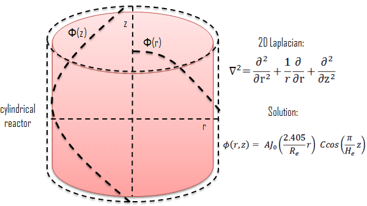

.. SciML_RP documentation master file, created by
   sphinx-quickstart on Sun Jun  4 16:33:14 2023.
   You can adapt this file completely to your liking, but it should at least
   contain the root `toctree` directive.

Welcome to SciNEA's Team!
====================================

**SciNEA: Scientific Computing for Nuclear Engineering Applications**

Team Members
====================================

.. .. |QiaolinHe| image:: ./_static/prof/QiaolinHe.png
..                     :width: 206
..                     :height: 289
.. .. |ShiquanZhang| image:: ./_static/prof/ShiquanZhang.png
..                     :width: 206
..                     :height: 289
.. .. |HelinGong| image:: ./_static/prof/HelinGong.png
..                     :width: 206
..                     :height: 289

.. |QiaolinHe| image:: ./_static/prof/QiaolinHe.png
                    :width: 206

.. |HelinGong| image:: ./_static/prof/HelinGong.png
                    :width: 206

.. .. |YuYang| image:: ./_static/stu/YuYang.png
..                     :width: 167
..                     :height: 213
.. .. |QihongYang| image:: ./_static/stu/QihongYang.png
..                     :width: 167
..                     :height: 213
.. .. |ShupeiYu| image:: ./_static/stu/ShupeiYu.png
..                     :width: 167
..                     :height: 213
.. .. |XufanChen| image:: ./_static/stu/XufanChen.png
..                     :width: 167
..                     :height: 213

.. |YuYang| image:: ./_static/stu/YuYang.png
                  :width: 167
.. |QihongYang| image:: ./_static/stu/QihongYang.png
                    :width: 167
.. |ShupeiYu| image:: ./_static/stu/ShupeiYu.png
                    :width: 167
.. |XufanChen| image:: ./_static/stu/XufanChen.png
                    :width: 167

.. =================      ==================  ================
.. |QiaolinHe|            |ShiquanZhang|      |HelinGong|
.. =================      ==================  ================
.. Prof. Qiaolin He       A.P. Shiquan Zhang  A.P. Helin Gong
.. =================      ==================  ================

.. _Prof. Qiaolin He: https://math.scu.edu.cn/info/1013/3065.htm
.. _A.P. Shiquan Zhang: https://math.scu.edu.cn/info/1013/3056.htm
.. _A.P. Helin Gong: https://speit.sjtu.edu.cn/faculty/team-152.html

+--------------------+---------------------+--------------------+
|    |QiaolinHe|     |  |ShiquanZhang|     |     |HelinGong|    |
+--------------------+---------------------+--------------------+
| `Prof. Qiaolin He`_|`A.P. Shiquan Zhang`_| `A.P. Helin Gong`_ |
+--------------------+---------------------+--------------------+

.. _PhD. Yu Yang: https://github.com/YangYuSCU
.. _PhD. Qihong Yang: https://github.com/SummerLoveRain

+-------------------+---------------------+--------------------+--------------------+
|     |YuYang|      |     |QihongYang|    |    |ShupeiYu|      |     |XufanChen|    |
+-------------------+---------------------+--------------------+--------------------+
|`PhD. Yu Yang`_    | `PhD. Qihong Yang`_ |   M.S. Shupei Yu   |   M.S. Xufan Chen  |
+-------------------+---------------------+--------------------+--------------------+

Research Fields
====================================

**Research Fields:**

 | **Scientific Computing + Maching Learning**

 | **Numerical Methods of Fluid Mechanics**

 | **Construction and Analysis of High-Precision Finite Element Method**

 | **Fast Algorithms for Solving Linear Equations**

 | **Model Reduction method and Machine Learning Methods**

 | **Modeling and Reconstruction based on Experimental Data**

 | **...**

Members of the team were awarded **the second prize of natural science by the Ministry of Education in 2020**, undertook **three research projects of the National Natural Science Foundation of China**, presided over **two sub-projects of the National Key Research and Development Program** and **one pre-research project of the installation and development**, published more than 50 papers in well-known national journals such as JCP and SIAM Multiscale Model and Simulation, and granted one patent. 

Recently, they have successfully completed the development of a module for 3D ground stress modelling and display of shale gas; designed an efficient pre-processing method for rapid solution of large-scale linear equation systems for subsea oil field development, improving the simulation efficiency; established a reconstruction model and algorithm based on partial observation data of reactors and fuel rods, realizing data reconstruction and inversion of physical parameters.

.. .. |Boat| image:: ./_static/nuclear/boat.png
..                   :width: 257
..                   :height: 149
.. .. |Base| image:: ./_static/nuclear/base.png
..                   :width: 257
..                   :height: 149
.. .. |Core| image:: ./_static/nuclear/core.png
..                   :width: 257
..                   :height: 149

.. |Boat| image:: ./_static/nuclear/boat.png
                  :width: 257
.. |Base| image:: ./_static/nuclear/base.png
                  :width: 257
.. |Core| image:: ./_static/nuclear/core.png
                  :width: 257

+------------+------------+---------------+
|  |Boat|    |  |Base|    |     |Core|    |
+------------+------------+---------------+

Research Awards
====================================

1. Won **the Second Class of Progress of Science and Technology Prize of Sichuan Province (First author)**. Research and development of key technologies for online monitoring system of HPR1000 reactor core 2021

2. Won **the Second Class of Progress of Science and Technology Prize of China Nuclear Energy Association (Ninth author)**. Independent design research and equipment development of HPR1000 reactor core measurement system 2021

3. Won **the China patent awards of excellence (Fourth author)**. A realization method of reactor LPD and DNBR online protection and monitoring 2021

Some Problems and Results
====================================

DEPINN: A Data-Enabled Physics-Informed Neural Network
----

.. |1D_circle| image:: ./_static/results/1D_circle.png

.. |IAEA| image:: ./_static/results/2D_IAEA.png

+-------------------------+---------------------------+
||1D_circle|              |  |2D_cylinder|            |
+-------------------------+---------------------------+
|Finite spherical reactor |Finite cylindrical reactor |
+-------------------------+---------------------------+
|`https://www.nuclear-power.com/nuclear-power/reactor |
|-physics/neutron-diffusion-theory/finite-spherical-  |
|reactor/`                                            |
+-----------------------------------------------------+

+----------------------------------------------------+
||IAEA|                                              |
+----------------------------------------------------+
|The 2D IAEA Benchmark Problem (IBP) (1977) modeled  |
|by two-dimension two-group diffusion equations,     |
|which was adapted from a practical nuclear reactor. |
+----------------------------------------------------+

+----------------------------------------------------+
||DEPINN|                                            |
+----------------------------------------------------+
|The process of solving the 2D IBP by DEPINN.        |
+----------------------------------------------------+

DEPINN: Uncertainty Analysis
----

.. |DEPINN_noise| image:: ./_static/results/DEPINN_noise.png

+----------------------------------------------------+
||DEPINN_noise|                                      |
+----------------------------------------------------+
|The process of solving parametric neutron diffusion |
|eigenvalue problems containing noisy data by DEPINN.|
+----------------------------------------------------+

.. |2D_cylinder_noise| image:: ./_static/results/noise_2.png

+-----------------------------------------------------+
||1D_circle_noise|                                    |
+-----------------------------------------------------+
|Finite spherical reactor: prediction 𝑢 from different|
|prior data noise scales. Interval loss is used in    |
|(a)(c) on the left, and SSE loss is used in (b)(d) on|
|the right. (a) 𝜎 = 0.05. (b) 𝜎 = 0.05. (c) 𝜎 = 0.1.  |
|(d) 𝜎 = 0.1.                                         |
+-----------------------------------------------------+
||2D_cylinder_noise|                                  |
+-----------------------------------------------------+
|Finite cylindrical reactor: prediction 𝑢 from        |
|different prior data noise scales. Interval loss     |
|is used in (a)(c) on the left, and SSE loss is used  |
|in (b)(d) on the right. (a) 𝜎 = 0.05. (b) 𝜎 = 0.05.  |
|(c) 𝜎 = 0.1.  (d) 𝜎 = 0.1.                           |
+-----------------------------------------------------+

GIPMNN: Generalized Inverse Power Method Neural Network
----
At first, we present how to use the generalized inverse power method to solve the following Equation.

.. math::
      \boldsymbol{A} \boldsymbol{\phi} = \lambda \boldsymbol{B} \boldsymbol{\phi}

The key step we need to focus on is shown in the following Equation, where :math:`\mathbf{A}` and :math:`\mathbf{B}` are two matrices, :math:`\lambda_{k-1}` and :math:`\boldsymbol{\phi}_{k-1}` are the results of previous iteration. Therefore, :math:`\lambda_k` and :math:`\boldsymbol{\phi}_k`  are obtained by the following Equation.

.. math::
      &\boldsymbol{A} \boldsymbol{\phi}_k = \lambda_{k-1} \boldsymbol{B} \boldsymbol{\phi}_{k-1}, \\
      &\lambda_k = \frac{<\boldsymbol{A}\boldsymbol{\phi}_{k}, \boldsymbol{\phi}_{k}>}{<\boldsymbol{B}\boldsymbol{\phi}_{k}, \boldsymbol{\phi}_{k}>}

We use the neural network :math:`\mathcal{N}^{\theta}` to represent the approximated eigenvector :math:`\Phi`. The :math:`\mathcal{N}^{\theta}` is utilized to represent the neural network and the eigenfunction :math:`\phi` can be denoted as :math:`\Phi=\mathcal{N}^{\theta}`. In GIPMNN, the following Equation is an analogue to the key code of generalized inverse power method, where :math:`\mathcal{L}` and :math:`\mathcal{Q}` are linear differential operators which are implemented by AD rather than specially discretized matrices. The same as the generalized inverse power method, we will record the results :math:`\lambda_{k-1}` of previous iteration. One difference with the generalized inverse power method is that instead of recording :math:`\boldsymbol{\phi}_{k-1}`, we record :math:`\mathcal{Q}\Phi_{k-1}`. It is worth noting that :math:`\Phi_{k-1}` is the eigenfunction represented by the neural network in :math:`(k-1)`-th iteration and :math:`\mathcal{Q}\Phi_{k-1}` is realized by AD. In :math:`k`-th iteration, we directly compute :math:`\Phi_{k}` through the neural network, that is, :math:`\Phi_k = \mathcal{N}^{\theta}`, and calculate :math:`\mathcal{L}\Phi_{k}` by AD. 

.. math::
      &\mathcal{L} \Phi_{k} = \lambda_{k-1} \mathcal{Q} \Phi_{k-1}, \\
      &\lambda_k = \frac{<\mathcal{L}\Phi_{k}, \Phi_{k}>}{<\mathcal{Q}\Phi_{k}, \Phi_{k}>}

Since we attain :math:`\Phi_k` directly through the neural network instead of solving the equation :math:`\mathcal{L} \Phi_{k} = \lambda_{k-1} \mathcal{Q} \Phi_{k-1}`, we define the loss function :math:`Loss_{gipmnn}` in the following Equation to propel the neural network to learn :math:`\Phi_k`.

.. math::
      Loss_{gipmnn} = \sum_{i=1}^N \lvert \mathcal{L} \Phi_k(\boldsymbol{x}_i) - \lambda_{k-1} \mathcal{Q} \Phi_{k-1}(\boldsymbol{x}_i) \rvert ^2

When the neural network gets convergence, we obtain the smallest eigenvalue and the associated eigenfunction expressed by the neural network.

PC-GIPMNN: Physics-Constrained GIPMNN
----

.. |PC_GIPMNN| image:: ./_static/results/PC_GIPMNN.png

+----------------------------------------------------+
||PC_GIPMNN|                                         |
+----------------------------------------------------+
|Illustration of PC-GIPMNN architecture diagram.     |
|There are multiple neurons in the output layer      |
|which denote the eigenfunctions in different        |
|sub-domains.                                        |
+----------------------------------------------------+

+--------------------------------------------------------------------------------------------------------+
||IAEA_PG|                                                                                               |
+--------------------------------------------------------------------------------------------------------+
|The first column shows the heatmap of the eigenfunction of FEM (the first column) and the other columns | 
|show the heatmaps of the relative error of GIPMNN (the second column), PC-GIPMNN (the third column) and |
|DRM (the fourth column) for the 2D IAEA benchmark problem. Due to enforcing the interface conditions,   |
|PC-GIPMNN outperforms GIPMNN and DRM, as shown in the third column.                                     |
+--------------------------------------------------------------------------------------------------------+

Publications
====================================

DEPINN
----

#. Yu Yang, Helin Gong, Shiquan Zhang, Qihong Yang, Zhang Chen, Qiaolin He, Qing Li, `A data-enabled physics-informed neural network with comprehensive numerical study on solving neutron diffusion eigenvalue problems <https://www.sciencedirect.com/science/article/abs/pii/S0306454922006867?via%3Dihub>`_, *Annals of Nuclear Energy*. 2023, 183:109656
#. Yu Yang, Helin Gong, Qiaolin He, Qihong Yang, Yangtao Deng and Shiquan Zhang, `On the uncertainty analysis of the data-enabled physics-informed neural network for solving neutron diffusion eigenvalue problem <https://arxiv.org/abs/2303.08455>`_, *arXiv preprint arXiv:2302.04107*, 2023.

PMNN and IPMNN
----
#. Qihong Yang, Yangtao Deng, Yu Yang, Qiaolin He, Shiquan Zhang, `Neural Networks Based on Power Method and Inverse Power Method for Solving Linear Eigenvalue Problems <https://arxiv.org/abs/2209.11134>`_, *arXiv preprint arXiv:2209.11134*, 2022.

GIPMNN and PC-GIPMNN
----
#. Qihong Yang, Yu Yang, Yangtao Deng, Qiaolin He, Helin Gong, Shiquan Zhang, `A Physics-Constrained Neural Network for Solving Discontinuous Interface K-eigenvalue Problem with Application to Reactor Physics <https://arxiv.org/abs/2209.11134>`_, preprint, 2023

Cited by
====================================
#. Kim G, Heo G. `Solving partial differential equation for atmospheric dispersion of radioactive material using physics-informed neural network <https://www.sciencedirect.com/science/article/pii/S1738573323001195>`_. Nuclear Engineering and Technology, 2023, 55(6): 2305-2314.

.. .. |SCUMath| image:: ./_static/scu/scu_math.jpg
..                   :width: 454
..                   :height: 87
.. .. |SPEIT| image:: ./_static/speit/speit.png
..                   :width: 527
..                   :height: 87
.. .. |SCUMath| image:: ./_static/scu/scu_math_red.png
..                   :width: 380
..                   :height: 60
.. .. |SPEIT| image:: ./_static/speit/speit.png
..                   :width: 520
..                   :height: 50
.. |SCUMath| image:: ./_static/scu/scu_math_red.png
                  :width: 380

+--------------+------------+
|   |SCUMath|  | |SPEIT|    |
+--------------+------------+

.. .. toctree::
..    :maxdepth: 2
..    :caption: contents:

..    modules/team_members.rst
..    modules/research_fields.rst
..    modules/papers.rst

.. Indices and tables
.. ==================

.. * :ref:`genindex`
.. * :ref:`modindex`
.. * :ref:`search`
